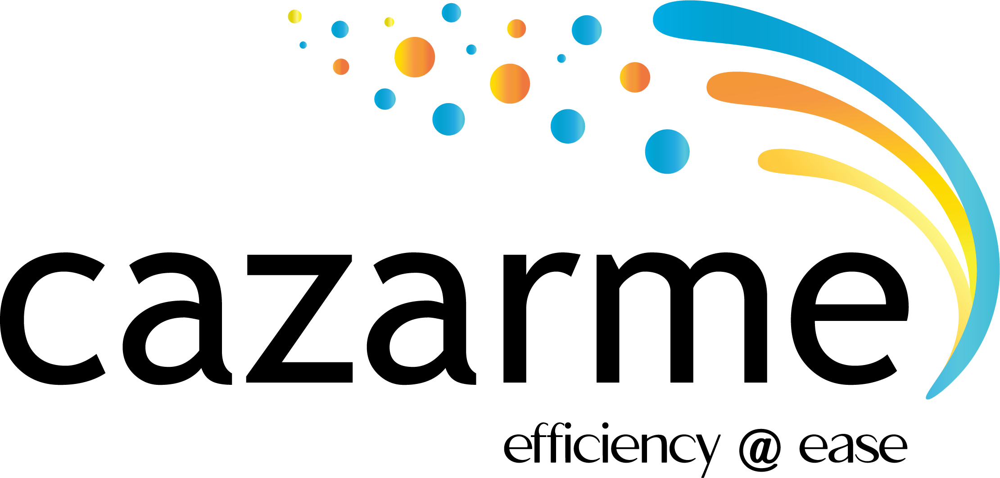

<h2 style="color: #007BFF;">Ventures</h2> <!-- Blue for Ventures -->

### Cloud Walk Enterprises

<!--  -->

Cloud Walk Enterprises is a software development and consulting company I founded in 2022. We specialize in creating custom software solutions for small and medium-sized businesses, focusing on:

- **Web and Mobile Development**
- **Software Architecture**
- **Startup Advising**

Our team has delivered high-quality solutions across industries such as healthcare, finance, and education, empowering clients with innovative technology.

---

### Stealth Startup

I am currently building a new solution leveraging AI and machine learning. Stay tuned for updates!

---

### Cazarme INC

I co-founded and led Cazarme as CEO during the pandemic. Cazarme was a B2B SaaS startup that leveraged Natural Language Processing (NLP) to analyze user research interviews.

- **Accelerator Program**: Alchemist Accelerator Cohort XXIX
- **Backed By**: Lightspeed Venture Partners and Accel
- **Impact**: Enabled businesses to deeply understand their customers and derive actionable insights from the user research process.

---

<h2 style="color:rgb(5, 253, 5);">Teachings</h2> <!-- Green for Teachings -->

### Sustainable Entrepreneurship Hackathon – Northeastern University (Fall 2024)

I had the privilege of designing and leading a workshop on **problem identification and customer discovery** at Northeastern University’s Sustainable Innovation Startup Hackathon. I taught a room of over 30 undergraduate and graduate students how to identify problems and validate their assumptions through customer discovery. Read more about the workshop in my [LinkedIn article](https://www.linkedin.com/pulse/problem-identification-customer-discovery-jadal-williams-rjn0e/?trackingId=fMiicdD7Q8GluJvrFjo6pQ%3D%3D).

---

### MIT Founders Journey (Fall 2023)

I had the honor of speaking at MIT’s **Founders Journey** class, sharing insights from my entrepreneurial journey with undergraduate students. I engaged students with actionable advice and real-world examples of turning ideas into viable products.
